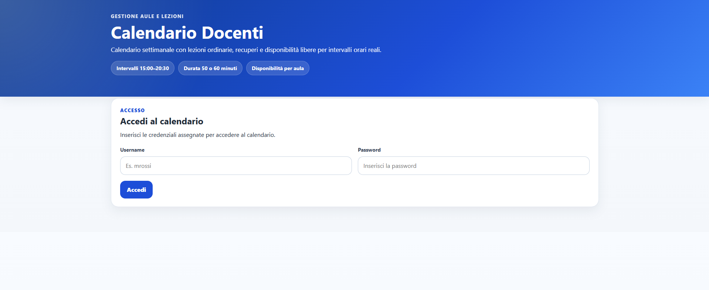
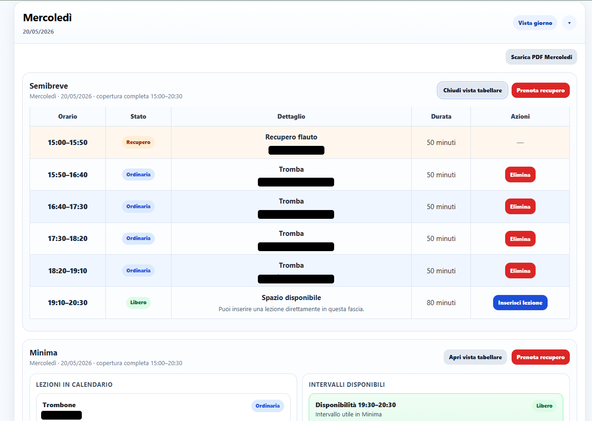
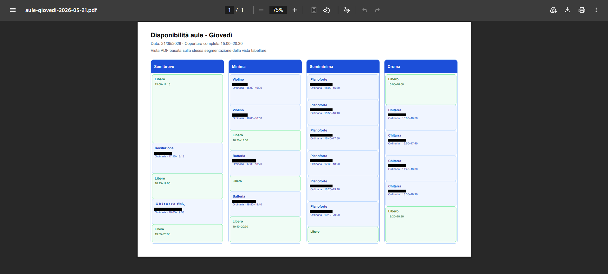

# Teachers Calendar Manager

A web-based scheduling and room management application developed to support the operational workflow of a music school.

The tool helps coordinate teacher schedules, room availability, ordinary lessons, recovery lessons and daily calendar views through a simple interface designed for non-technical users.

## Live Demo

[Open the deployed application](https://www.accademiamusicalegirolamoscarasciullo.com/CalendarioDocenti/calendariodocenti.html)

## Problem

Music schools often need to coordinate multiple teachers, rooms, lesson durations and recovery lessons within a weekly schedule.

This creates practical scheduling constraints such as:

- avoiding overlapping bookings;
- checking room availability;
- handling ordinary and recovery lessons;
- supporting teacher-specific calendar views;
- exporting daily schedules for operational use.

## Solution

Teachers Calendar Manager provides a lightweight web interface for managing scheduling workflows in a music school context.

The application focuses on usability, clarity and practical workflow support rather than unnecessary complexity.

## Main Features

- Teacher login
- Admin and teacher roles
- Weekly calendar view
- Daily calendar view
- Room-based availability management
- Ordinary lesson scheduling
- Recovery lesson scheduling
- Teacher-specific workflows
- User management
- Password change and reset flow
- PDF export
- Overlap prevention for conflicting bookings

## Screenshots

### Login



### Weekly View



### PDF Export



## Technical Overview

The application follows a lightweight full-stack architecture:

| Layer | Technologies | Responsibility |
|---|---|---|
| Frontend | HTML, CSS, JavaScript, jQuery | User interface, calendar rendering, modals, AJAX interactions |
| Backend | PHP | Authentication, authorization, scheduling endpoints, persistence logic |
| Storage | Private PHP array files | File-based storage for users, ordinary lessons and recovery lessons |
| PDF Export | jsPDF, jsPDF-AutoTable | Daily calendar export for operational use |

The application is intentionally simple and self-contained, making it easy to deploy on a standard PHP-based hosting environment without requiring a full database server.


## System Architecture

```text
User Interface
    |
    | AJAX requests
    v
PHP Endpoints
    |
    | authentication, validation, scheduling rules
    v
Private Storage
    |
    | users.php / database.php
    v
Calendar Data
```

The backend separates authentication logic, user management, ordinary lesson scheduling, recovery lesson scheduling and PDF-oriented data loading into dedicated endpoints.

## Project Structure

```text
teachers-calendar-manager/
├── calendariodocenti.html        # Main application page
├── styles.css                    # Application styling and responsive layout
├── script.js                     # Main frontend logic and AJAX interactions
├── export-pdf.js                 # PDF export logic
├── auth.php                      # Authentication, authorization and shared backend utilities
├── login.php                     # Login endpoint
├── logout.php                    # Logout endpoint
├── whoami.php                    # Current session/user endpoint
├── load.php                      # Loads ordinary and recovery lessons
├── save_ordinary.php             # Saves ordinary weekly lessons
├── save_recovery.php             # Saves date-specific recovery lessons
├── delete_ordinary.php           # Deletes ordinary lessons
├── delete_recovery.php           # Deletes recovery lessons
├── check_recovery_availability.php # Checks available recovery lesson slots
├── add_user.php                  # Admin endpoint for adding users
├── remove_user.php               # Admin endpoint for removing users
├── list_users.php                # Admin endpoint for listing users
├── get_user_credentials.php      # Admin endpoint for resetting user credentials
├── change_password.php           # User password change endpoint
├── examples/
│   ├── users.example.php         # Example local users file
│   └── database.example.php      # Example local bookings database
├── private/
│   └── .gitkeep                  # Placeholder for private runtime data
└── assets/
    └── screenshots
```

## Scheduling Logic

The application separates two types of lessons:

- **ordinary lessons**, recurring weekly and associated with a weekday;
- **recovery lessons**, date-specific and associated with a real calendar date.

Each booking is represented by:

- teacher;
- room;
- lesson type;
- course name;
- start time;
- duration;
- computed end time.

Before saving a booking, the backend checks whether the selected teacher or room is already occupied in the requested time interval.

Two intervals are considered conflicting when they overlap:

```text
startA < endB AND endA > startB
```

This rule is applied to:

- room availability;
- teacher availability;
- ordinary weekly lessons;
- date-specific recovery lessons.

The system also enforces the allowed daily time window:

```text
15:00–20:30
```

This prevents invalid bookings outside the operational schedule.

## Local Setup

This project requires a PHP-enabled web server.

### 1. Clone the repository

```bash
git clone https://github.com/mikabba/teachers-calendar-manager.git
cd teachers-calendar-manager
```

### 2. Start a local PHP server

```bash
php -S localhost:8000
```

Then open:

```text
http://localhost:8000/calendariodocenti.html
```

### 3. Runtime data

The application stores runtime data inside the `private/` folder.

The repository includes only:

```text
private/.gitkeep
```

Real user and booking data are intentionally excluded from version control.

Example runtime files are provided in:

```text
examples/users.example.php
examples/database.example.php
```

To run the application locally, copy them into:

```text
private/users.php
private/database.php
```

### 4. First admin user

Before using the application, create a local `private/users.php` file with a first admin user.

For privacy reasons, real production users are not included in this repository.

You can use the example file provided in:

```text
examples/users.example.php
```

Copy it into:

```text
private/users.php
```

Then log in with:

```text
username: admin
password: admin12345
```

This account is intended only for local testing.

## Portfolio Relevance

This project demonstrates my ability to build deployed software tools for real users.

It complements my engineering portfolio by showing:

- practical software design;
- workflow-oriented thinking;
- user-facing web application development;
- scheduling and constraint handling;
- role-based access;
- deployment of a working tool in a real context;
- documentation of a real-world software project.

## Known Limitations

- The current version uses file-based storage instead of a relational database.
- The application is designed for a specific music school workflow and may require adaptation for other organizations.
- The public repository does not include production user data or real booking records.
- The current setup is intended as a lightweight deployed tool, not as a large-scale multi-tenant platform.

## Next Steps

- Add a system overview diagram
- Improve deployment documentation
- Add a sanitized demo dataset
- Add automated validation tests for scheduling conflicts
- Consider migrating from file-based storage to SQLite or MySQL for larger deployments
